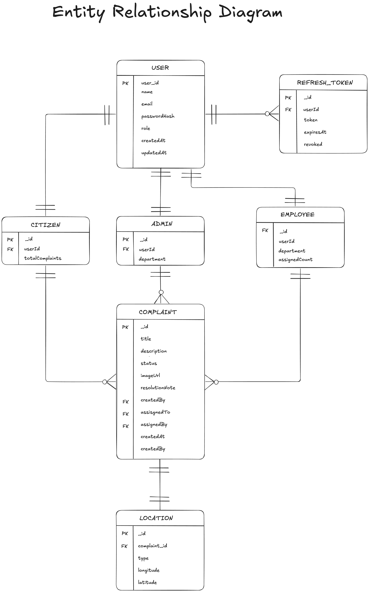
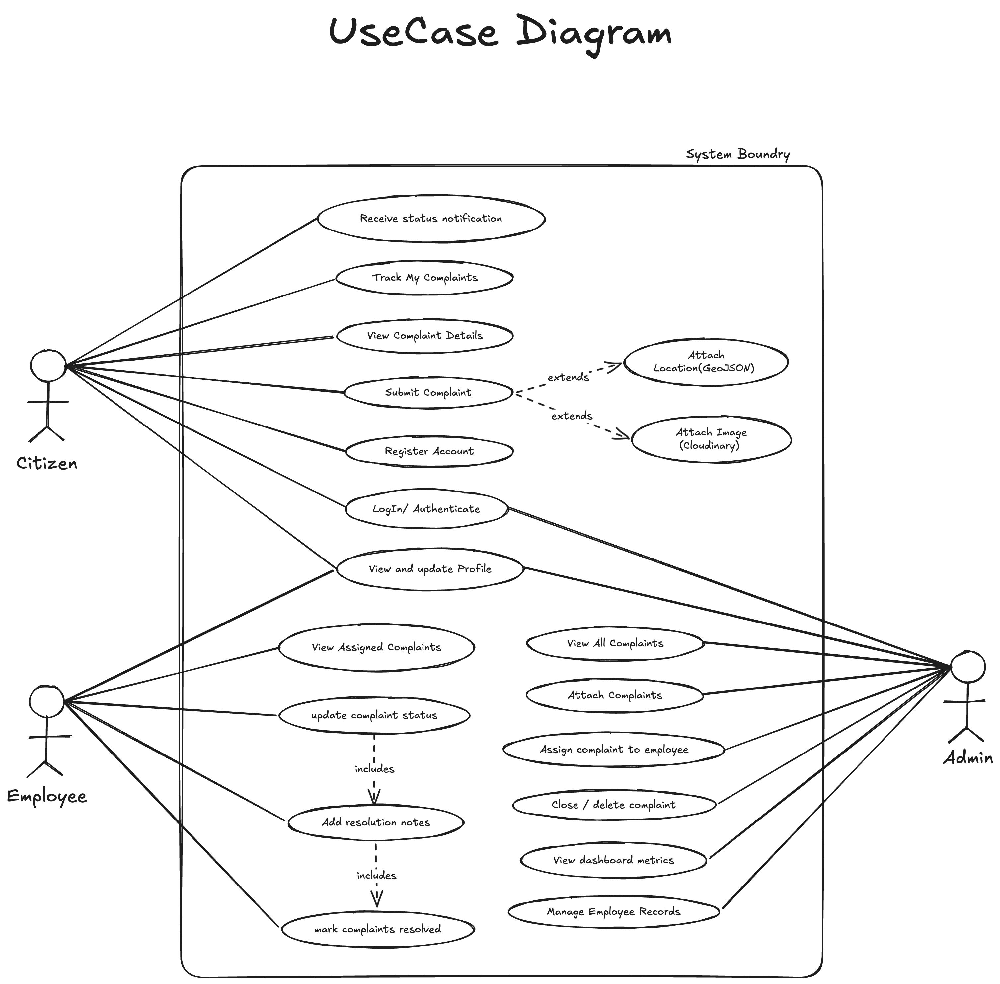
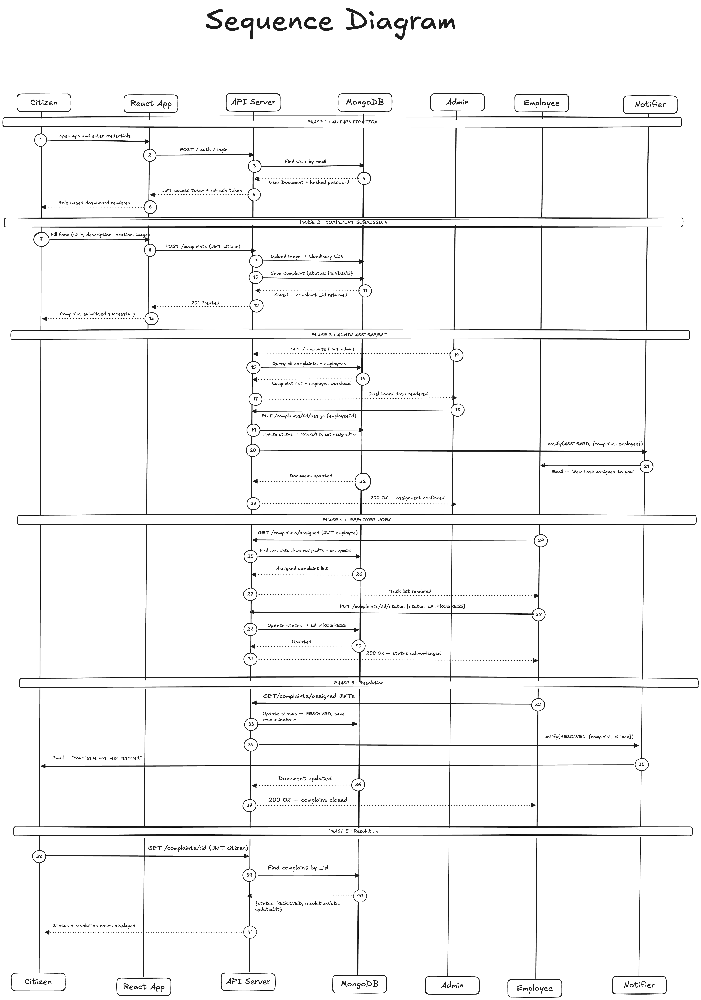

<div align="center">


<p align="center">
  A full-stack civic complaint management system with real-time updates, role-based access, and geospatial complaint tracking — built for modern municipalities.
</p>

<br/>

### 🛠 Tech Stack

<p align="center">
  <a href="https://react.dev"></a>&nbsp;
  <a href="https://vitejs.dev"></a>&nbsp;
  <a href="https://tailwindcss.com"></a>&nbsp;
  <a href="https://expressjs.com"></a>&nbsp;
  <a href="https://www.mongodb.com"></a>&nbsp;
  <a href="https://nodejs.org"></a>&nbsp;
  <a href="https://socket.io"></a>&nbsp;
  <a href="https://reactrouter.com"></a>&nbsp;
  <a href="https://leafletjs.com"></a>
</p>

<br/>

<p align="center">
  
  &nbsp;
  
  &nbsp;
  
  &nbsp;
  
  &nbsp;
  
</p>

</div>

---

## What Is CivicTrack?

CivicTrack is a **Software Design capstone project** — a full-stack web application that digitizes the civic complaint lifecycle from submission to resolution. Citizens report local issues, admins assign them to municipal employees, and employees update statuses in real time. Every status change is broadcast instantly via Socket.IO, and admins can visualize performance through a dedicated metrics dashboard.

The system supports **three distinct roles** — Citizen, Admin, and Employee — each with their own protected route tree, dashboard, and set of permissions.

---

## Features

| Feature | Details |
|---|---|
| **Role-Based Access** | Three separate route trees: `/citizen`, `/admin`, `/employee` — protected by Clerk JWT + role metadata |
| **Complaint Lifecycle** | `PENDING → ASSIGNED → IN_PROGRESS → RESOLVED` with full audit history on every transition |
| **Real-Time Updates** | Socket.IO room-based subscriptions — clients join `complaint_{id}` rooms and receive live status pushes |
| **Geospatial Tagging** | Complaints carry GeoJSON `Point` coordinates; MongoDB `2dsphere` index enables location-aware queries |
| **Admin Metrics Dashboard** | Recharts-powered analytics: complaint volume, status distribution, resolution trends |
| **Employee Management** | Admin can create and list employees directly through the Clerk API (no separate user DB) |
| **Map Picker** | `react-leaflet` integration lets citizens pin an exact location when filing a complaint |
| **Code-Split Routing** | Every page is `lazy()`-loaded via React Suspense for optimal initial bundle size |
| **Hardcoded Admin Bypass** | Dev/demo fallback: a hardcoded admin credential that issues a local token, skipping Clerk |

---

## Architecture Overview

```
CivicTrack/
├── frontend/          # Vite + React 19 SPA
├── backend/           # Express 5 REST API + Socket.IO server
├── database/          # Mongoose models + connection helper
├── uml_diagrams/      # Class, ER, Sequence, Use-Case diagrams (PNG)
├── .env.example       # Frontend env vars template
├── .env.server.example# Backend env vars template
├── vercel.json        # SPA rewrite rule for Vercel
├── DEPLOYMENT.md      # Detailed deploy guide (Vercel + Render)
└── package.json       # Monorepo root — runs both frontend and backend
```

The project is a **monorepo with a shared `node_modules`** — a single `npm install` installs all deps for both layers.

---

## Detailed Folder Structure

### `/frontend`

```
frontend/
├── index.html                  # Vite HTML entry point
├── vite.config.js              # Vite config: dev proxy → :8787, alias @→src
├── tailwind.config.js          # Tailwind v3 configuration
├── postcss.config.js           # PostCSS (autoprefixer)
└── src/
    ├── main.jsx                # App bootstrap: ClerkProvider + Router + AuthProvider
    ├── App.jsx                 # Thin root that renders <AppRoutes />
    ├── App.css / index.css     # Global base styles
    │
    ├── routes/
    │   ├── AppRoutes.jsx       # Full route tree — lazy pages, role guards, SSO callback
    │   ├── ProtectedRoute.jsx  # Redirects unauthenticated users to /login
    │   └── RoleRoute.jsx       # Redirects users to their role's base path if mismatched
    │
    ├── context/
    │   ├── AuthContext.jsx     # AuthProvider: Clerk token sync, role derivation, hardcoded-admin login
    │   ├── authContextObject.js# createContext() singleton (prevents circular imports)
    │   └── useAuth.js          # useContext(AuthContext) shorthand hook
    │
    ├── api/
    │   ├── apiConfig.js        # Reads VITE_API_ORIGIN; resolves base URL (empty = Vite proxy)
    │   ├── axiosInstance.js    # Axios instance with base URL from apiConfig
    │   ├── complaintApi.js     # All complaint CRUD + assign + status update calls
    │   ├── adminApi.js         # Employee list + create calls
    │   ├── sessionToken.js     # Injects Authorization: Bearer <token> header per request
    │   └── mockApi.js          # Stub for offline testing
    │
    ├── hooks/
    │   ├── useAllComplaints.js         # Admin: fetch all complaints
    │   ├── useCitizenComplaints.js     # Citizen: fetch own complaints by citizenId
    │   ├── useEmployeeComplaints.js    # Employee: fetch complaints assigned to them
    │   ├── useComplaintDetails.js      # Single complaint + Socket.IO room join
    │   ├── useComplaintActions.js      # Mutation hooks: assign, update status, delete
    │   └── useEmployees.js             # Admin: list + create employees
    │
    ├── domain/
    │   ├── Complaint.js               # Complaint class: fromApiResponse(), isResolved()
    │   └── ComplaintStatusPolicy.js   # Frontend mirror of backend status transition rules
    │
    ├── data/
    │   ├── statusConstants.js         # STATUS enum, categories[], departments[]
    │   ├── roleConstants.js           # ROLES enum + ROLE_VALUES array
    │   ├── authConstants.js           # ADMIN_EMAIL, ADMIN_PASSWORD, HARDCODED_ADMIN_TOKEN
    │   ├── socketConstants.js         # Socket event name constants
    │   └── mockData.js                # Local mock complaint fixtures for development
    │
    ├── lib/
    │   ├── adminUi.js                 # Status label/color/icon mapping for Admin views
    │   └── utils.js                   # cn() class merge helper
    │
    ├── utils/
    │   ├── constants.js               # Shared frontend constants
    │   └── socket.js                  # socket.io-client singleton factory
    │
    ├── components/
    │   ├── layout/
    │   │   ├── AppLayout.jsx          # Shell: sidebar nav + <Outlet /> for role sections
    │   │   ├── AppPillNavbar.jsx      # Animated pill-style sidebar nav with role-aware links
    │   │   └── AppPageHeader.jsx      # Page title + optional action button header
    │   │
    │   └── ui/
    │       ├── ComplaintCard.jsx      # Card for complaint list items
    │       ├── ConfirmDialog.jsx      # Reusable confirm/cancel modal
    │       ├── EmptyState.jsx         # Zero-data placeholder with icon + message
    │       ├── MapPicker.jsx          # react-leaflet map with draggable pin
    │       ├── Modal.jsx              # Generic modal wrapper
    │       ├── SkeletonLoader.jsx     # Loading skeleton placeholder
    │       └── StatusBadge.jsx        # Color-coded complaint status chip
    │
    └── pages/
        ├── auth/
        │   ├── LoginPage.jsx          # Clerk SignIn + hardcoded admin form
        │   ├── RegisterPage.jsx       # Clerk SignUp
        │   ├── RoleOnboardingPage.jsx # Post-signup role + department selection
        │   └── AuthPageBackdrop.jsx   # Decorative background for auth pages
        │
        ├── citizen/
        │   ├── CitizenDashboard.jsx   # Summary cards: total, pending, resolved
        │   ├── MyComplaintsPage.jsx   # Paginated list of citizen's own complaints
        │   ├── NewComplaintPage.jsx   # Multi-field form: title, category, description, map pin, image
        │   └── ComplaintDetailPage.jsx# Full complaint view + status history timeline
        │
        ├── admin/
        │   ├── AdminDashboard.jsx     # Quick-stats overview for admins
        │   ├── AllComplaintsPage.jsx  # Filterable table of all complaints + assign action
        │   ├── AssignComplaintModal.jsx# Employee picker modal for assignment
        │   ├── EmployeeManagementPage.jsx # Create + list employees (Clerk-backed)
        │   └── AdminMetricsPage.jsx   # Recharts charts: volume, status distribution, trends
        │
        ├── employee/
        │   ├── EmployeeDashboard.jsx         # Assigned task summary for the logged-in employee
        │   ├── AssignedComplaintsPage.jsx    # List of complaints assigned to this employee
        │   └── UpdateStatusModal.jsx         # IN_PROGRESS / RESOLVED form with notes
        │
        └── shared/
            └── ProfilePage.jsx        # Displays current user's name, email, role, department
```

---

### `/backend`

```
backend/
├── index.js                    # Server entry: Express app, CORS, routes, Socket.IO, MongoDB connect
│
├── config/
│   ├── env.js                  # dotenv loader — reads .env.server
│   ├── clerk.js                # Lazy Clerk SDK client factory (requires CLERK_SECRET_KEY)
│   └── constants.js            # SERVER_CONSTANTS: routes, roles, status values, socket events, CORS origins
│
├── middleware/
│   ├── auth.js                 # verifyToken (Clerk JWT + hardcoded admin), authorize(...roles)
│   └── errorHandler.js         # Global Express error handler → structured JSON error response
│
├── routes/
│   ├── complaints.js           # GET /, GET /:id, POST /, PATCH /:id/assign, PATCH /:id/status, DELETE /:id
│   └── admin.js                # GET /employees, POST /employees (Clerk-backed)
│
├── services/
│   ├── ComplaintService.js     # Business logic: create, list, get, assign, updateStatus, delete; ID generation
│   ├── EmployeeService.js      # Clerk API: createUser with employee role metadata, listEmployees
│   └── NotificationService.js  # Wraps getIO() to emit `status_updated` events to complaint rooms
│
├── repositories/
│   └── ComplaintRepository.js  # Mongoose data access: findAll, findByPublicId, create, save, deleteByPublicId, existsByPublicId
│
├── policies/
│   ├── ComplaintStatusPolicy.js# Validates which statuses employees are allowed to set (IN_PROGRESS, RESOLVED)
│   └── AdminCredentialPolicy.js# Validates hardcoded admin email/password for local dev
│
├── errors/
│   └── AppError.js             # Custom error class with `statusCode` + `InvalidComplaintStatusError` subclass
│
└── utils/
    ├── socket.js               # initSocket(): creates Socket.IO server, handles join_complaint room subscriptions; getIO()
    └── complaintId.js          # generateComplaintId(): random CMP-XXXX format ID
```

---

### `/database`

```
database/
├── connect.js                  # connectDatabase(): mongoose.connect() with MONGO_URI
├── README.md                   # Notes on the database layer
└── models/
    └── Complaint.js            # Mongoose schema with 4 indexes (citizenId, assignedTo, status, 2dsphere)
```

**Complaint Schema fields:** `id` (public CMP-XXXX), `title`, `citizenId`, `citizenName`, `category`, `description`, `address`, `location` (GeoJSON Point), `imageUrl`, `images[]`, `status`, `assignedTo`, `resolutionNotes`, `submittedAt`, `history[]`

---

### `/uml_diagrams`

| File | Content |
|---|---|
| `class_diagram.png` | Backend class relationships: Services, Repositories, Policies, Errors |
| `erDiagram.png` | Entity-Relationship diagram for the Complaint data model |
| `sequence_diagram.png` | Request flow: Citizen → API → Service → Repository → Socket notification |
| `use_case.png` | Use-case diagram for all three actor roles |

---

## API Reference

**Base URL:** `/api/v1`

### Complaints

| Method | Endpoint | Role | Description |
|---|---|---|---|
| `GET` | `/complaints` | Any | List complaints (filter by `citizenId` or `assignedTo` via query param) |
| `GET` | `/complaints/:id` | Any | Get single complaint by public ID (e.g. `CMP-4823`) |
| `POST` | `/complaints` | Citizen | Submit a new complaint |
| `PATCH` | `/complaints/:id/assign` | Admin | Assign complaint to an employee |
| `PATCH` | `/complaints/:id/status` | Employee | Update complaint status (`IN_PROGRESS` or `RESOLVED`) |
| `DELETE` | `/complaints/:id` | Admin | Delete a complaint |

### Admin / Employees

| Method | Endpoint | Role | Description |
|---|---|---|---|
| `GET` | `/admin/employees` | Admin | List all users with the `employee` role from Clerk |
| `POST` | `/admin/employees` | Admin | Create a new employee user in Clerk with role metadata |

### Utility

| Method | Endpoint | Description |
|---|---|---|
| `GET` | `/` | Service info JSON |
| `GET` | `/health` | Health check `{ ok: true }` |

---

## Real-Time Events (Socket.IO)

| Event | Direction | Payload |
|---|---|---|
| `join_complaint` | Client → Server | `complaintId: string` — joins room `complaint_{id}` |
| `status_updated` | Server → Client | Full complaint object after any status change or assignment |

---

## Authentication Flow

```
User logs in (Clerk or hardcoded admin)
       ↓
Clerk issues JWT session token
       ↓
Frontend stores token in AuthContext (window.__sccmsToken for debug)
       ↓
Every API call adds: Authorization: Bearer <token>
       ↓
Backend verifyToken middleware:
  - Hardcoded admin token?  → inject { id, role: admin } directly
  - Clerk JWT?              → verify with @clerk/backend, fetch Clerk user,
                              derive role from email or publicMetadata.role
       ↓
authorize(...roles) checks req.user.role before route handler runs
```

---

## Local Development

### Prerequisites

- Node.js ≥ 18
- MongoDB Atlas cluster (or local MongoDB)
- Clerk account with a configured application

### Setup

```bash
# 1. Clone the repository
git clone https://github.com/your-username/civic-track.git
cd civic-track

# 2. Install all dependencies (frontend + backend share node_modules)
npm install

# 3. Configure frontend environment
cp .env.example .env
# Set VITE_CLERK_PUBLISHABLE_KEY in .env
# Leave VITE_API_ORIGIN empty — Vite proxy handles /api → localhost:8787

# 4. Configure backend environment
cp .env.server.example .env.server
# Set CLERK_SECRET_KEY, MONGO_URI, API_PORT, CORS_ORIGINS in .env.server
```

### Run

```bash
# Start the frontend (Vite dev server on :5173)
npm run dev

# Start the backend (Express + Socket.IO on :8787)
npm run dev:api
```

The Vite dev server proxies `/api` and `/socket.io` requests to `http://localhost:8787`, so no manual CORS setup is needed locally.

---

## Deployment

| Layer | Platform | Key Config |
|---|---|---|
| Frontend SPA | **Vercel** | Framework: Vite, Output: `dist/`, `vercel.json` rewrites all routes to `index.html` |
| Backend API | **Render** | Start: `npm start`, Health: `/health`, `PORT` auto-injected by Render |
| Database | **MongoDB Atlas** | Connection via `MONGO_URI` env var |

**Required environment variables:**

| Variable | Where | Purpose |
|---|---|---|
| `VITE_CLERK_PUBLISHABLE_KEY` | Vercel | Clerk frontend key |
| `VITE_API_ORIGIN` | Vercel | Render backend origin (e.g. `https://civic-track-api.onrender.com`) |
| `VITE_SOCKET_URL` | Vercel | Socket.IO origin (defaults to `VITE_API_ORIGIN` if empty) |
| `CLERK_SECRET_KEY` | Render | Clerk backend secret key |
| `MONGO_URI` | Render | MongoDB Atlas connection string |
| `CORS_ORIGINS` | Render | Comma-separated allowed frontend origins |

> **Never commit real credentials.** If a secret is ever pushed, rotate it in Clerk and MongoDB Atlas immediately.

---

## UML Diagrams

<table>
  <tr>
    <td align="center"><b>ER Diagram</b></td>
    <td align="center"><b>Use Case</b></td>
  </tr>
  <tr>
    <td></td>
    <td></td>
  </tr>
  <tr>
    <td align="center"><b>Class Diagram</b></td>
    <td align="center"><b>Sequence Diagram</b></td>
  </tr>
  <tr>
    <td></td>
    <td></td>
  </tr>
</table>

---

## Tech Stack

| Category | Technology | Version |
|---|---|---|
| Frontend Framework | React | 19 |
| Build Tool | Vite | 8 |
| Styling | Tailwind CSS | 3 |
| Routing | React Router DOM | 7 |
| Forms | React Hook Form | 7 |
| Auth | Clerk (React + Backend SDK) | Latest |
| HTTP Client | Axios | 1 |
| Real-Time | Socket.IO (client + server) | 4 |
| Maps | React Leaflet + Leaflet | 5 / 1.9 |
| Charts | Recharts | 3 |
| Notifications | React Hot Toast | 2 |
| Icons | Lucide React | Latest |
| Date Formatting | date-fns | 4 |
| Backend Framework | Express | 5 |
| Database ODM | Mongoose | 9 |
| Runtime | Node.js | ≥ 18 |

---

<div align="center">

Made as a Software Design Capstone · Built with React, Express, MongoDB, and Clerk

</div>
