# CivicTrack System Design

CivicTrack is a civic complaint management system where citizens submit local issues, admins review and assign them, and employees resolve assigned work. The project is implemented as a React/Vite single page app with an Express, MongoDB, Clerk, and Socket.IO backend.

This document describes the system through object-oriented design, system design, and software engineering principles. It is written to explain both the current implementation and the target architecture the project should keep moving toward.

## 1. Problem Statement

Municipal complaint handling is often slow because complaint intake, assignment, progress tracking, and citizen visibility are fragmented. CivicTrack provides a single digital workflow:

- citizens can register, submit complaints, attach location/media details, and track status
- admins can view complaints, manage employees, assign work, and monitor metrics
- employees can view assigned complaints and update progress or resolution
- users can receive realtime status updates for complaint details

## 2. Goals

### Functional Goals

- User authentication and role-based access for citizen, admin, and employee users.
- Citizen complaint creation with title, category, description, address, location, and images.
- Complaint listing and detail views for role-specific workflows.
- Admin assignment of complaints to employees.
- Employee status updates from assigned to in progress or resolved.
- Realtime complaint detail updates using Socket.IO rooms.
- Admin dashboard and metrics views.

### Non-Functional Goals

- Maintainability: separate UI, state, API, domain, and persistence concerns.
- Extensibility: add new statuses, roles, departments, or assignment strategies without large rewrites.
- Security: protect routes and backend endpoints with authentication and authorization.
- Reliability: preserve complaint history and lifecycle state changes.
- Scalability: support growth in complaints, users, and realtime connections.
- Observability: make errors, health checks, and operational state easy to inspect.

## 3. Current Technology Stack

| Layer | Technology | Responsibility |
| --- | --- | --- |
| Frontend | React 19, Vite | SPA rendering and user workflows |
| Routing | React Router | Role-based route trees and redirects |
| Styling | Tailwind CSS, lucide-react | UI composition and icons |
| Auth | Clerk | User sessions, Clerk JWTs, user metadata |
| API Client | Axios and fetch | HTTP communication with backend |
| Backend | Express 5 | REST API and middleware pipeline |
| Database | MongoDB with Mongoose | Complaint persistence |
| Realtime | Socket.IO | Complaint status update notifications |
| Charts | Recharts | Admin metrics visualization |
| Deployment | Vercel config present for frontend rewrites | SPA fallback routing |

## 4. High-Level Architecture

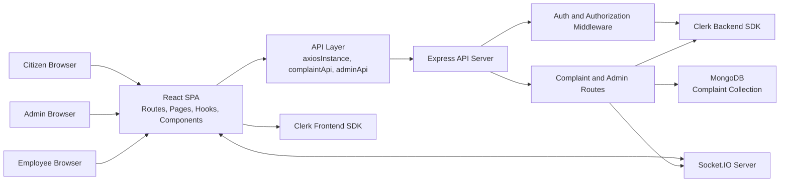

The system follows a client-server architecture. The React application is responsible for user interaction and role-specific page composition. The Express backend owns authorization checks, complaint mutations, employee creation, MongoDB persistence, and realtime event emission.

## 5. Runtime Deployment View

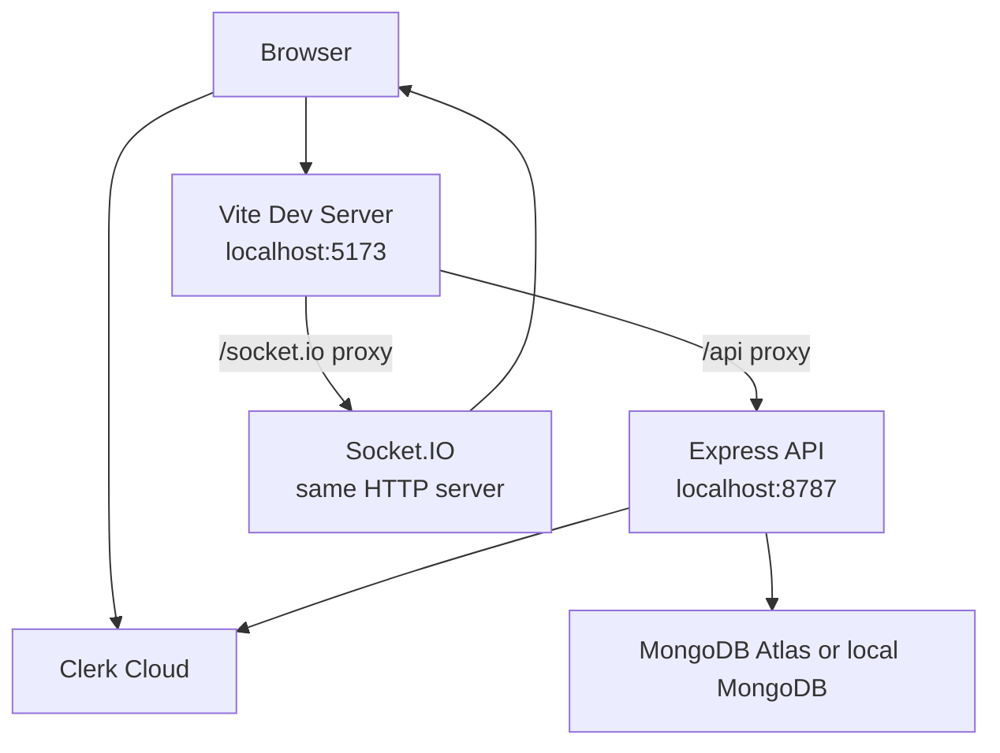

In development, Vite proxies `/api` and `/socket.io` to the Express server. The frontend API client uses `/api/v1` through the proxy for most complaint operations. Employee creation currently uses `AUTH_CONSTANTS.API_BASE_URL`, which points to `http://localhost:8787`.

## 6. Architectural Layers

### Frontend Layers

| Directory | Responsibility |
| --- | --- |
| `src/routes/` | Route tree, role gates, redirects, page lazy loading |
| `src/pages/` | Page-level composition and workflow screens |
| `src/components/` | Reusable UI components and layout components |
| `src/hooks/` | Stateful data-fetching and mutation orchestration |
| `src/api/` | HTTP transport and backend API wrappers |
| `src/context/` | Auth state and session distribution |
| `src/data/` | Static constants and app-level data |
| `src/utils/` | Pure helper values and utility functions |
| `src/lib/` | Shared UI tokens and future domain abstractions |

Recommended dependency direction:

```text
routes -> pages -> hooks -> api -> backend
pages -> components
components -> utils/data/lib
context -> Clerk SDK
```

Frontend rules:

- Page components should compose hooks and presentational components.
- Components should not perform direct API calls.
- Hooks should own loading, error, and reload state.
- API modules should be the only place that knows endpoint details.
- Constants should be imported from named modules instead of being duplicated.

### Backend Layers

| Directory | Responsibility |
| --- | --- |
| `server/index.js` | Application bootstrap, middleware registration, server startup |
| `server/config/` | Environment, constants, Clerk configuration |
| `server/middleware/` | Authentication, authorization, error handling |
| `server/routes/` | HTTP endpoint wiring |
| `server/services/` | Application use cases and lifecycle orchestration |
| `server/repositories/` | Persistence gateway abstractions |
| `server/policies/` | Role, credential, and status decision rules |
| `server/errors/` | Typed application errors |
| `server/models/` | Mongoose schemas and persistence contracts |
| `server/utils/` | Socket helper and ID generation |

Recommended dependency direction:

```text
index -> routes -> middleware/models/utils/config
middleware -> config/Clerk
models -> mongoose only
utils -> config only
```

Backend rules:

- Routes should validate request intent and delegate domain-heavy behavior.
- Middleware should handle cross-cutting concerns like auth and errors.
- Persistence schema should enforce required fields and defaults.
- Environment-specific values should live in config, not route handlers.

## 7. Core Domain Model

The main domain is complaint lifecycle management.

### Domain Entities

| Entity | Responsibility |
| --- | --- |
| `User` | Base identity from Clerk with id, name, email, role, department |
| `Citizen` | User who submits and tracks complaints |
| `Admin` | User who assigns complaints and manages employees |
| `Employee` | User who works on assigned complaints |
| `Complaint` | Civic issue submitted by a citizen |
| `ComplaintHistoryEntry` | Immutable audit event for complaint lifecycle changes |
| `Location` | GeoJSON point and address data |
| `Department` | Work grouping used for employee classification |

### Complaint Fields

The current MongoDB complaint schema includes:

| Field | Meaning |
| --- | --- |
| `id` | Public complaint identifier such as `CMP-1234` |
| `title` | Short complaint title |
| `citizenId` | Clerk user id of submitting citizen |
| `citizenName` | Display name of submitting citizen |
| `category` | Complaint category |
| `description` | Full complaint description |
| `address` | Human-readable location |
| `location` | GeoJSON point with coordinates |
| `imageUrl` | Single legacy image URL |
| `images` | Image URL list |
| `status` | Current lifecycle state |
| `assignedTo` | Assigned employee id |
| `resolutionNotes` | Final employee resolution note |
| `submittedAt` | Creation timestamp |
| `history` | Ordered lifecycle events |

### Complaint Status Lifecycle

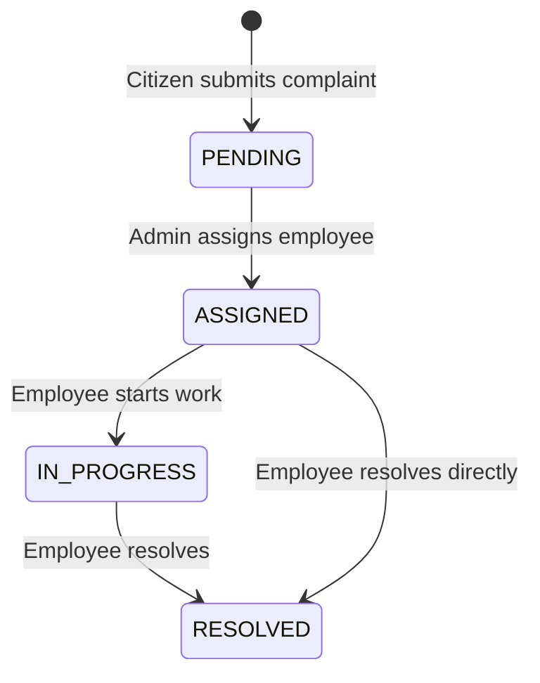

Current backend-supported statuses:

- `PENDING`
- `ASSIGNED`
- `IN_PROGRESS`
- `RESOLVED`

The frontend also defines `CLOSED`, but the backend does not currently produce or transition to it. If `CLOSED` is needed, add it intentionally to the backend lifecycle and API rules.

## 8. Object-Oriented Design

The current React implementation is mostly functional, which is normal for React. OOP still applies at the domain and service design level. The recommended object model is:

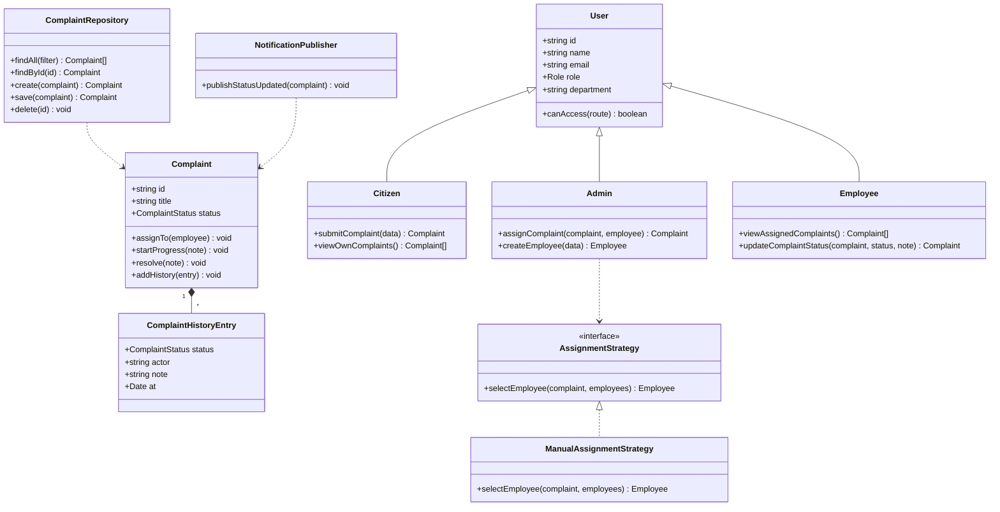

### OOP Principles Applied

#### Encapsulation

Complaint lifecycle changes should be wrapped behind methods such as `assignTo`, `startProgress`, and `resolve`. This prevents scattered code from directly mutating `status`, `assignedTo`, and `history` separately.

Current code routes these lifecycle changes through `ComplaintService`, which keeps Express handlers focused on HTTP concerns.

#### Abstraction

The UI should not know whether data comes from MongoDB, Clerk, or Socket.IO. Hooks and API modules hide those details.

Current abstraction examples:

- `useAllComplaints` hides loading and error state.
- `useComplaintActions` hides mutation details.
- `complaintApi` hides endpoint paths.
- `verifyToken` hides Clerk token verification.

#### Inheritance

Role-specific users can be modeled as specialized user types: `Citizen`, `Admin`, and `Employee`. In implementation, prefer composition and role policies unless inheritance clearly simplifies behavior.

Good conceptual inheritance:

```text
User
  -> Citizen
  -> Admin
  -> Employee
```

Good implementation alternative:

```text
User + RolePolicy
```

React and JavaScript apps often benefit more from composition than deep inheritance.

#### Polymorphism

Behavior that varies by role, status, or assignment policy should be selected through maps, strategies, or policy objects instead of long conditional chains.

Examples:

- role routes: citizen/admin/employee route trees
- status badge styles: map status to visual class
- assignment: manual, round-robin, department-based, or load-based strategy
- allowed transitions: status transition policy per current state

Recommended status policy:

```js
const statusTransitions = {
  PENDING: ["ASSIGNED"],
  ASSIGNED: ["IN_PROGRESS", "RESOLVED"],
  IN_PROGRESS: ["RESOLVED"],
  RESOLVED: [],
};
```

## 9. SOLID Principles

### Single Responsibility Principle

Each module should have one reason to change.

Current examples:

- `src/api/axiosInstance.js`: configures HTTP client only
- `src/hooks/useAllComplaints.js`: manages all-complaint loading state
- `server/middleware/auth.js`: verifies identity and role access
- `server/models/Complaint.js`: defines persistence schema

Improvement:

- Keep complaint lifecycle mutation rules inside `ComplaintService` rather than route handlers.

### Open/Closed Principle

The system should be open for extension but closed for modification.

Good target examples:

- Add a new assignment strategy by creating a new strategy class or function.
- Add a new complaint status by updating one lifecycle policy.
- Add a new role by adding route policy and authorization mapping.

Avoid:

- Editing many pages and route handlers every time a status or role changes.

### Liskov Substitution Principle

If role-specific user classes are introduced, `Citizen`, `Admin`, and `Employee` should be usable wherever a `User` is expected without breaking behavior.

Example:

```text
renderProfile(user: User)
```

This should work for any role-specific user object.

### Interface Segregation Principle

Clients should depend only on the capabilities they need.

Examples:

- Citizen UI should depend on complaint creation and own complaint listing.
- Employee UI should depend on assigned complaints and status updates.
- Admin UI should depend on all complaints, assignment, metrics, and employee management.

Do not expose one huge `api` object to every page when role-specific service modules would be clearer.

### Dependency Inversion Principle

High-level business logic should depend on interfaces, not concrete details.

Target backend shape:

```text
ComplaintService -> ComplaintRepository interface
ComplaintRepositoryMongo -> Mongoose Complaint model
NotificationService -> NotificationPublisher interface
SocketNotificationPublisher -> Socket.IO
```

This makes testing easier because services can use fake repositories and fake notification publishers.

## 10. Recommended Backend Service Design

The backend now uses service, repository, policy, and error layers around complaint and employee behavior. As the system grows, keep adding business behavior to these layers instead of pushing it back into route handlers:

```text
server/
  services/
    ComplaintService.js
    EmployeeService.js
    AuthService.js
    NotificationService.js
  repositories/
    ComplaintRepository.js
    ClerkUserRepository.js
  policies/
    ComplaintStatusPolicy.js
    RolePolicy.js
    AssignmentPolicy.js
```

### ComplaintService Responsibilities

- Create complaint with generated id and initial history.
- Assign complaint to employee.
- Validate allowed status transitions.
- Append history entries.
- Save complaint through repository.
- Trigger notification publisher after successful mutation.

### ComplaintRepository Responsibilities

- Encapsulate Mongoose queries.
- Provide `findAll`, `findByPublicId`, `create`, `save`, and `delete`.
- Hide database details from route handlers and services.

### NotificationService Responsibilities

- Publish `status_updated` event to complaint room.
- Hide Socket.IO room naming from domain logic.

### StatusPolicy Responsibilities

- Define legal transitions.
- Keep status validation in one place.
- Return clear validation errors for illegal transitions.

## 11. API Design

Current API base path:

```text
/api/v1
```

### Complaint Endpoints

| Method | Path | Role | Responsibility |
| --- | --- | --- | --- |
| `GET` | `/api/v1/complaints` | authenticated | List complaints, optionally filtered by `citizenId` |
| `GET` | `/api/v1/complaints/:id` | authenticated | Get complaint detail |
| `POST` | `/api/v1/complaints` | citizen | Create complaint |
| `PATCH` | `/api/v1/complaints/:id/assign` | admin | Assign complaint to employee |
| `PATCH` | `/api/v1/complaints/:id/status` | employee | Update complaint status |
| `DELETE` | `/api/v1/complaints/:id` | admin | Delete complaint |

### Admin Endpoints

| Method | Path | Role | Responsibility |
| --- | --- | --- | --- |
| `POST` | `/api/v1/admin/employees` | admin credential headers | Create employee user in Clerk |
| `GET` | `/api/v1/admin/employees` | admin | List employee users from Clerk |

### API Response Principles

- Use stable JSON shapes for frontend compatibility.
- Return meaningful status codes: `201`, `400`, `401`, `403`, `404`, `409`, `500`.
- Return error bodies in the shape `{ "message": "..." }`.
- Do not expose internal stack traces to clients.

### API Improvements

- Replace admin credential headers with authenticated admin JWT authorization for employee creation.
- Add server-side employee complaint filtering: `/complaints?assignedTo=<employeeId>`.
- Add pagination for complaint and employee lists.
- Add request validation for payload fields.
- Add idempotency or collision-resistant IDs for complaint creation.

## 12. Authentication and Authorization Design

### Current Authentication Flow

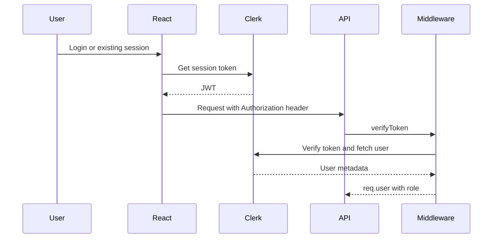

### Roles

| Role | Permissions |
| --- | --- |
| Citizen | Create complaints, view own complaints, view complaint details |
| Admin | View all complaints, assign complaints, delete complaints, manage employees, view metrics |
| Employee | View assigned complaints, update complaint status |

### Security Improvements

- Move admin email/password out of committed constants and into environment variables.
- Remove hardcoded admin token or restrict it to local development only.
- Use Clerk role metadata consistently for all privileged operations.
- Validate that citizens can only access their own complaint details unless admin/employee rules allow otherwise.
- Validate that employees can only update complaints assigned to them.
- Add rate limiting for authentication-sensitive and write endpoints.
- Add input validation and sanitization for complaint text fields.
- Add audit metadata for actor id, actor role, and source IP when mutating complaints.

## 13. Realtime Design

Current Socket.IO behavior:

- Client connects to `/socket.io`.
- Client emits `join_complaint` with a complaint id.
- Server joins the socket to room `complaint_<id>`.
- Server emits `status_updated` to the complaint room after assignment or status mutation.

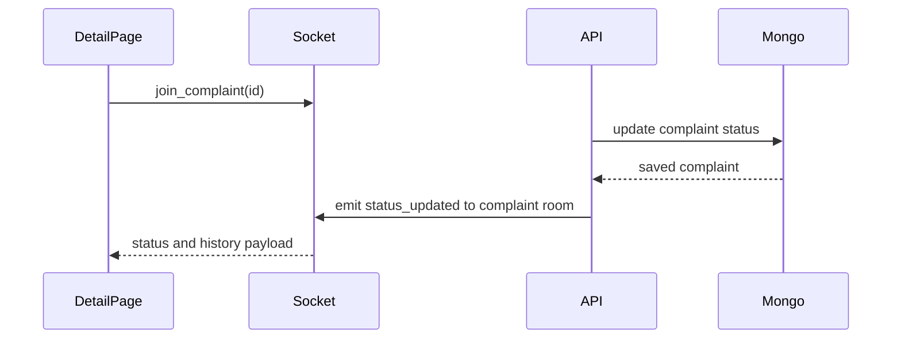

Realtime design rules:

- Use rooms for complaint-specific updates.
- Emit only after database writes succeed.
- Keep event names in constants on frontend and backend.
- Include enough payload to update UI without a full reload.

Improvements:

- Authenticate socket connections with Clerk token.
- Authorize room joins so users cannot subscribe to unrelated complaints.
- Add reconnect handling and fallback reload behavior.
- Add events for assignment, deletion, and comment/history additions if those features grow.

## 14. Frontend Design

### Route Structure

```text
/
/login
/register
/sso-callback
/citizen/dashboard
/citizen/complaints
/citizen/complaints/new
/citizen/complaints/:id
/citizen/profile
/admin/dashboard
/admin/complaints
/admin/employees
/admin/metrics
/admin/complaints/:id
/admin/profile
/employee/dashboard
/employee/tasks
/employee/tasks/:id
/employee/profile
```

### Frontend Flow

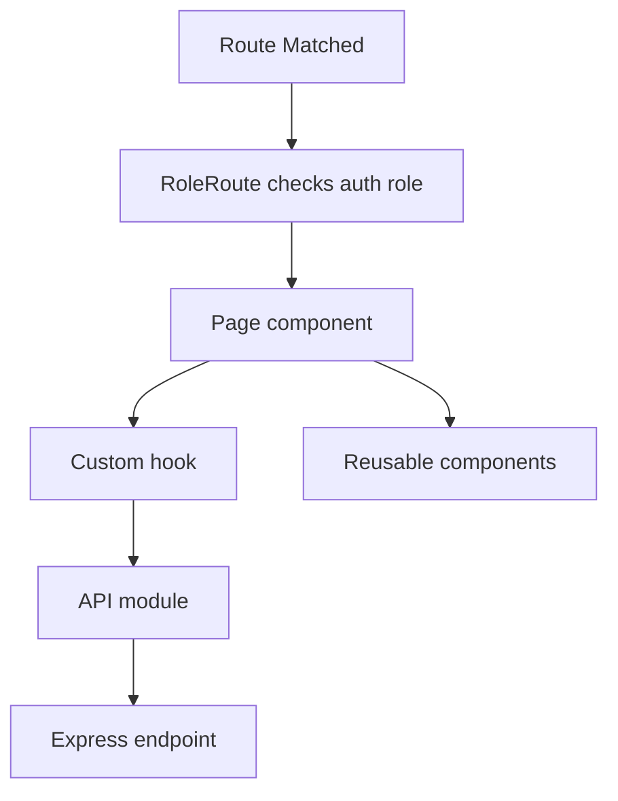

### Frontend Design Principles

- Keep page components thin.
- Use hooks for data lifecycle.
- Keep visual components reusable and side-effect free.
- Keep route protection centralized.
- Keep constants centralized.
- Prefer declarative maps for role/status UI behavior.

### Current Hook Responsibilities

| Hook | Responsibility |
| --- | --- |
| `useAllComplaints` | Load all complaints for admin views |
| `useCitizenComplaints` | Load complaints for one citizen |
| `useEmployeeComplaints` | Load all complaints and filter assigned ones client-side |
| `useComplaintDetails` | Load one complaint and subscribe to realtime updates |
| `useComplaintActions` | Expose complaint mutations |
| `useEmployees` | Load employees for assignment and admin management |

### Frontend Improvements

- Keep `mockApi` only as a backward-compatible alias while new code imports `complaintApi`.
- Create domain mappers like `Complaint.fromApiResponse` if the UI needs computed behavior.
- Move employee complaint filtering to the backend.
- Add a consistent API error object.
- Use constants for route paths and roles in `AppRoutes`.
- Add optimistic update only where rollback behavior is clear.

## 15. Backend Design

### Express Request Pipeline

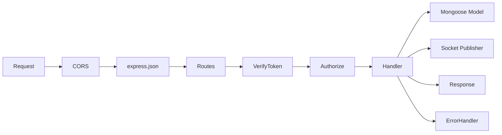

### Backend Design Principles

- Keep bootstrap code in `server/index.js`.
- Keep authentication and role checks in middleware.
- Keep database schema in models.
- Keep constants in config.
- Move domain rules into services as complexity grows.

### Backend Improvements

- Add route-level payload validation using a schema library.
- Add service/repository layers for complaint lifecycle behavior.
- Add database indexes for `citizenId`, `assignedTo`, `status`, and `submittedAt`.
- Replace random numeric complaint IDs with collision-resistant IDs.
- Add pagination, sorting, and filtering.
- Add structured logging.
- Add centralized async wrapper to reduce repeated `try/catch`.

## 16. Database Design

### Current Logical ER Model

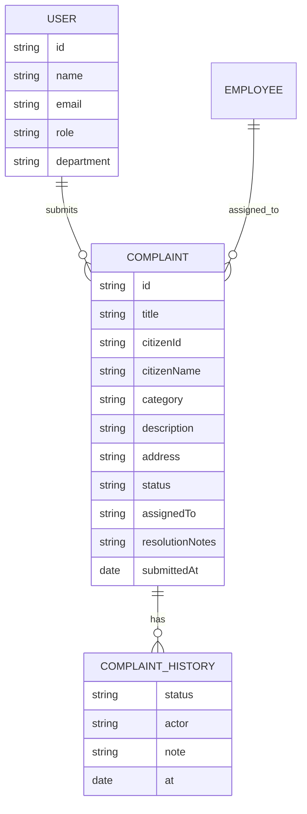

Users and employees are currently stored in Clerk, not MongoDB. Complaint documents reference Clerk user ids.

### Recommended Indexes

```js
complaintSchema.index({ id: 1 }, { unique: true });
complaintSchema.index({ citizenId: 1, submittedAt: -1 });
complaintSchema.index({ assignedTo: 1, status: 1 });
complaintSchema.index({ status: 1, submittedAt: -1 });
complaintSchema.index({ location: "2dsphere" });
```

### Data Consistency Rules

- Every complaint must have one initial history entry.
- `status` should always match the latest meaningful lifecycle event.
- Assignment should set both `assignedTo` and `ASSIGNED` status together.
- Resolution should include resolution notes when available.
- Deleting a complaint should be admin-only and ideally audited.

## 17. Important Workflows

### Citizen Creates Complaint

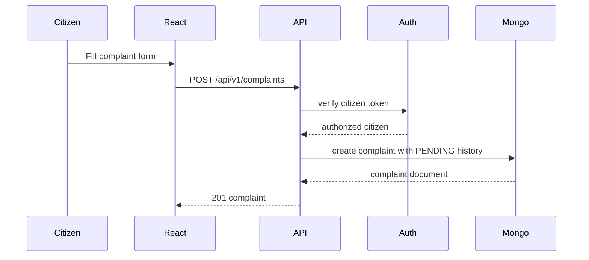

### Admin Assigns Complaint

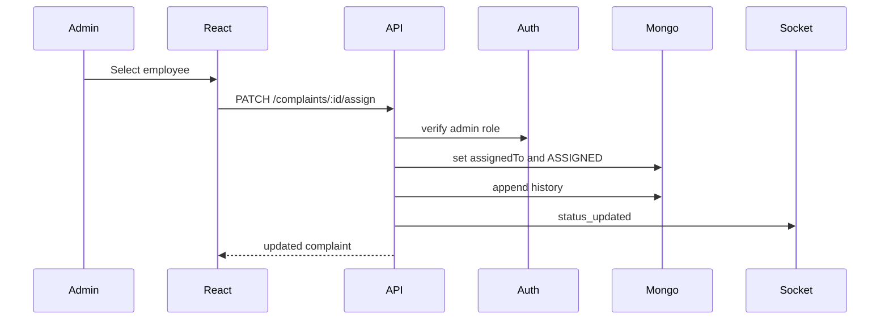

### Employee Updates Status

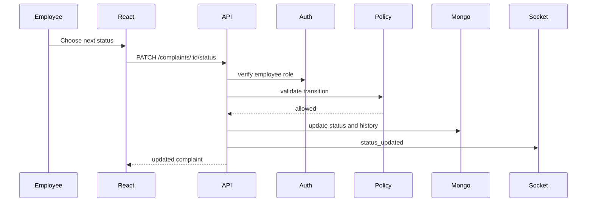

## 18. Design Patterns

| Pattern | Where It Fits | Benefit |
| --- | --- | --- |
| MVC-inspired layering | React pages and Express routes | Separates presentation, routing, and data |
| Repository | Complaint persistence | Hides Mongoose from business logic |
| Service Layer | Complaint lifecycle operations | Keeps route handlers thin |
| Strategy | Assignment policies | Adds new assignment algorithms cleanly |
| Factory Method | Domain mappers like `Complaint.fromApiResponse` | Normalizes external data |
| Observer/Pub-Sub | Socket.IO events | Pushes realtime updates |
| Middleware Chain | Express auth/error pipeline | Centralizes cross-cutting concerns |
| Policy Object | Role and status permissions | Keeps authorization decisions explicit |

## 19. Scalability Design

### Current Scale

The current design is suitable for a capstone/MVP with a single API server and MongoDB instance.

### Scaling Bottlenecks

- Complaint lists are loaded without pagination.
- Employee assigned complaints are filtered on the client.
- Socket.IO room state is local to one server process.
- Random complaint ids can collide as volume grows.
- No caching for dashboard metrics.

### Scale-Up Plan

1. Add backend pagination and filtering.
2. Add MongoDB indexes for common query patterns.
3. Move employee filtering to backend.
4. Add Redis adapter for Socket.IO when running multiple API instances.
5. Add metrics aggregation or cached dashboard summaries.
6. Use collision-resistant complaint identifiers.
7. Add object storage for images instead of direct arbitrary URLs.

## 20. Security Design

### Current Security Controls

- Clerk session tokens for authenticated users.
- Express `verifyToken` middleware.
- Role-based `authorize` middleware.
- Protected React routes through `RoleRoute`.
- CORS allowlist in backend config.

### Security Risks To Address

- Admin credentials and hardcoded token are committed in constants.
- Employee creation relies on special headers instead of normal admin JWT auth.
- Socket room joins are not authenticated.
- Citizen detail access should be checked server-side.
- Employee status updates should verify the complaint is assigned to the employee.
- Request bodies are not schema-validated.

### Recommended Security Controls

- Move secrets to `.env` and never commit them.
- Use Clerk public/private metadata for roles.
- Validate authorization at the backend for every sensitive resource.
- Add request body validation.
- Add rate limiting and request size limits.
- Add secure image upload pipeline.
- Add audit logs for admin and employee actions.

## 21. Error Handling Design

Current expected error shape:

```json
{ "message": "Complaint not found" }
```

Recommended error categories:

| Error Type | Status | Example |
| --- | --- | --- |
| AuthenticationError | `401` | Missing or expired token |
| AuthorizationError | `403` | Role cannot perform action |
| ValidationError | `400` | Invalid status transition |
| NotFoundError | `404` | Complaint not found |
| ConflictError | `409` | Employee email already exists |
| SystemError | `500` | Clerk or database failure |

Design rule:

- Throw typed errors in services.
- Normalize them in one global error middleware.
- Keep client-facing messages stable and safe.

## 22. Testing Strategy

### Unit Tests

Test pure logic:

- status transition policy
- complaint ID generation or ID service
- role policy
- complaint domain methods
- API response mappers

### Integration Tests

Test backend endpoints:

- citizen can create complaint
- admin can assign complaint
- employee can update status
- invalid roles are rejected
- invalid status is rejected
- not found response is correct

### Frontend Tests

Test user-facing workflows:

- role redirect behavior
- complaint form submission
- admin assignment modal
- employee status modal
- loading, empty, and error states

### End-to-End Tests

Test complete flows:

- citizen submits complaint, admin assigns, employee resolves, citizen sees update
- protected routes redirect correctly
- socket detail page receives status update

## 23. Maintainability Rules

1. No direct API calls from page or UI components.
2. No duplicated role names, status names, socket event names, or route paths.
3. No business rules hidden inside JSX.
4. No hardcoded credentials in source code.
5. Every mutation must update complaint history.
6. Every backend write endpoint must verify role and resource ownership.
7. Every new status must update lifecycle policy, UI badge mapping, and tests.
8. Every new role must update route policy, backend authorization, and user metadata rules.

## 24. Design Gaps In Current Implementation

These are not failures; they are normal MVP-to-production gaps.

| Area | Current State | Recommended Improvement |
| --- | --- | --- |
| Admin secret | Hardcoded in frontend and backend constants | Move to environment and use Clerk admin JWT auth |
| Employee filtering | Backend supports `assignedTo` filtering | Add pagination and ownership checks |
| Status lifecycle | Employee-settable status validation is centralized | Add full transition validation when behavior allows it |
| Complaint ID | Random `CMP-1000..9999` | Use database-safe sequence, nanoid, or UUID-backed public id |
| Socket auth | Room joins are unauthenticated | Authenticate and authorize socket subscriptions |
| Domain logic | Complaint lifecycle behavior lives in service/repository/policy modules | Add deeper domain methods only where complexity justifies them |
| Validation | Manual partial checks | Use schema validation |
| Tests | No visible test suite in package scripts | Add unit, integration, and E2E tests |
| Deployment | Frontend rewrite only in Vercel config | Define backend deployment, env vars, and socket hosting plan |

## 25. Target Refactor Roadmap

### Phase 1: Clean Naming And Constants

- Keep new API imports on `complaintApi`; remove the compatibility alias only after all external references are gone.
- Centralize frontend roles, statuses, routes, and socket events.
- Remove duplicate admin constants from frontend and backend.

### Phase 2: Backend Domain Layer

- Continue expanding service/repository boundaries for new features.
- Add deeper domain methods for complaint lifecycle behavior if rules become more complex.
- Keep route mutation logic inside service methods.

### Phase 3: Security Hardening

- Replace admin employee creation headers with authenticated admin route.
- Add resource ownership checks.
- Add request validation.
- Add socket auth.
- Move secrets to environment variables.

### Phase 4: Data And Scale

- Add MongoDB indexes.
- Add pagination/filtering endpoints.
- Add collision-resistant IDs.
- Add Redis Socket.IO adapter if horizontally scaling.

### Phase 5: Testing And Observability

- Add unit tests for policies and services.
- Add integration tests for API endpoints.
- Add frontend workflow tests.
- Add structured logging and health checks.

## 26. Suggested Package Structure After Refactor

```text
server/
  config/
  middleware/
  models/
  routes/
  services/
    ComplaintService.js
    EmployeeService.js
    NotificationService.js
  repositories/
    ComplaintRepository.js
    ClerkUserRepository.js
  policies/
    ComplaintStatusPolicy.js
    RolePolicy.js
  errors/
    AppError.js
    errorTypes.js
  utils/

src/
  api/
    complaintApi.js
    employeeApi.js
  components/
  context/
  data/
    roles.js
    statuses.js
    routes.js
    socketEvents.js
  domain/
    Complaint.js
    User.js
    policies/
  hooks/
  pages/
  routes/
  utils/
```

## 27. Existing UML Assets

The repository already contains diagram images in `uml_diagrams/`:

- `uml_diagrams/use_case.png`
- `uml_diagrams/class_diagram.png`
- `uml_diagrams/sequence_diagram.png`
- `uml_diagrams/erDiagram.png`

Those diagrams should be kept aligned with this document as the system evolves.

## 28. Final Design Summary

CivicTrack is best understood as a role-based complaint lifecycle platform. The frontend is a React SPA organized around routes, pages, hooks, API clients, and reusable components. The backend is an Express API that authenticates users through Clerk, persists complaints in MongoDB, and publishes realtime status updates through Socket.IO.

The strongest future architecture is a layered design:

```text
UI -> Hooks -> API Client -> Routes -> Services -> Repositories -> Database
                                      -> Notification Publisher -> Socket.IO
```

From an OOP perspective, the important domain objects are `User`, `Citizen`, `Admin`, `Employee`, `Complaint`, `ComplaintHistoryEntry`, and policy/strategy objects for status transitions and assignment. From a system design perspective, the most important next steps are centralizing business rules, hardening authorization, adding backend filtering/pagination, indexing MongoDB, authenticating sockets, and adding tests around the complaint lifecycle.
